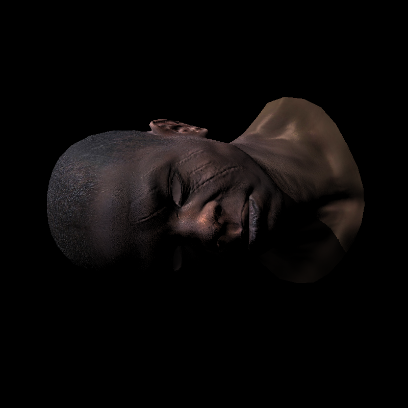
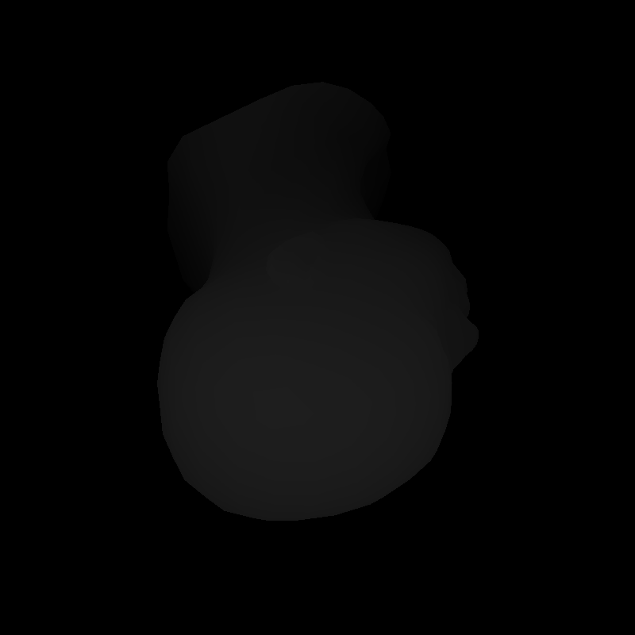

# 这是什么？

一个基于C/C++实现的软件光栅器。

跟随[Tiny Renderer](https://github.com/ssloy/tinyrenderer/wiki)这个课程。

安利一波这个教程，从Braseham画线、扫描法画三角形开始，到MVP变换，再到Shadow等各种画面效果，对光栅化整个的过程理解很有帮助...

# 效果

Shadow Buffer：

# 特性、TODO

- [x] MVP矩阵的计算
- [x] 切线空间贴图（当模型有动画时会有用）
- [x] 利用Shadow Buffer实现阴影